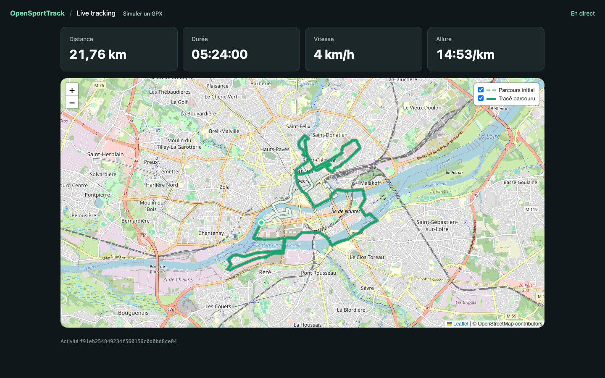

# OpenSportTrack

**Replay a GPX route as if it came from a watch, then follow the run live on a map.**

Go 1.27 · React 19 · Vite 8 · Ky · Zod · WebSocket · Leaflet

<p align="center">
  <a href="docs/images/live-nantes.png">
    
  </a>
</p>
<p align="center"><sub>Nantes Marathon after about 22 km of replay. Click to enlarge.</sub></p>

## At a glance

- **Two tracks on the map:** the full GPX route in a light color and the received progress in green, each with its own toggle.
- **Smooth tracking:** the position and metrics advance between received points. This interpolation is visual only; it does not create GPS measurements.
- **Two ways to simulate:** a Go client that follows GPX timestamps, or a web simulator with an adjustable interval (250 ms to 2 s).

## Run locally

Requirements: **Go 1.27**, **Node.js 24**, and npm. Docker is not required for development.

**Terminal 1 — API**, from the repository root:

```sh
go run ./apps/api
```

**Terminal 2 — web app**, from the repository root:

```sh
cd apps/web
npm ci
npm run dev
```

Open the **[web simulator](http://localhost:5173/simulator)**, select `examples/marathon-nantes-2016.gpx`, and start the replay. The live map appears on the page and can also be opened in a separate tab.

### Replay Nantes with the Go client

In a third terminal, from the repository root:

```sh
go run ./apps/simulator replay examples/marathon-nantes-2016.gpx --speed 300
```

The command prints a `/live/{activity_id}` URL to open in a browser. `--speed 300` compresses the time recorded in the GPX file; the web simulator uses a fixed sending interval that you can change during the run. The Go client also accepts `--server` and `--web-url` if you change the ports.

## How it works

```text
GPX → Go or web simulator → Go API → WebSocket → React map
```

| Location | Responsibility |
| --- | --- |
| [`apps/api`](apps/api) | HTTP server, GPS ingestion, and WebSocket broadcast |
| [`apps/simulator`](apps/simulator) | GPX replay client written in Go |
| [`apps/web`](apps/web) | Live map and simulator built with React and Vite |
| [`internal`](internal) | Shared Go packages private to the module |
| [`contracts`](contracts/http-ws-v1.md) | HTTP and WebSocket v1 contract |

Vite proxies `/api` and WebSocket traffic to the local API at `127.0.0.1:8081`. The two Go programs share a single root `go.mod`; the web app has its own `package.json`. OpenStreetMap tiles require an internet connection in the browser.

## Check the project

```sh
go test -race ./...
cd apps/web
npm ci
npm run lint
npm run format:check
npm test
npm run build
```

GitHub Actions runs the Go and web checks on pull requests and pushes to `main`.

To format Go and the web app from the repository root, run `./scripts/format.sh`.

After running `npm ci` in `apps/web`, enable the pre-push check for this clone with `./scripts/install-hooks.sh`. The hook checks the pushed commit with `gofmt` and Oxfmt. If formatting fails, run `./scripts/format.sh`, commit the changes, and push again. Each new clone must enable the hook separately.

## Docker, if needed

```sh
docker compose up --build
```

The web app is then available at [localhost:8080/simulator](http://localhost:8080/simulator) and the API at `localhost:8081`. To replay the GPX file in Compose:

```sh
docker compose run --rm simulator replay /data/marathon-nantes-2016.gpx --speed 300 --server http://api:8081 --web-url http://localhost:8080
```

## Documentation and current limitations

- [Monorepo architecture](docs/architecture.md)
- [HTTP and WebSocket v1 contract](contracts/http-ws-v1.md)
- [Technical design v0](docs/technical-design-v0.md)

This first version supports running only. State is kept in memory, so activities disappear when the API restarts. Authentication, persistence, and batch GPS uploads are not yet available.
