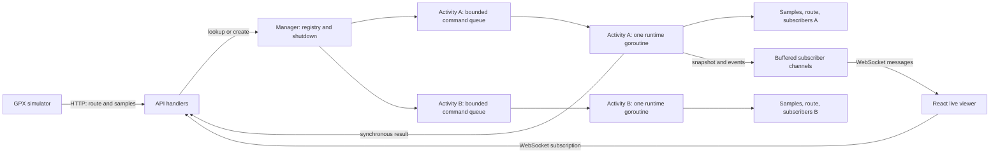
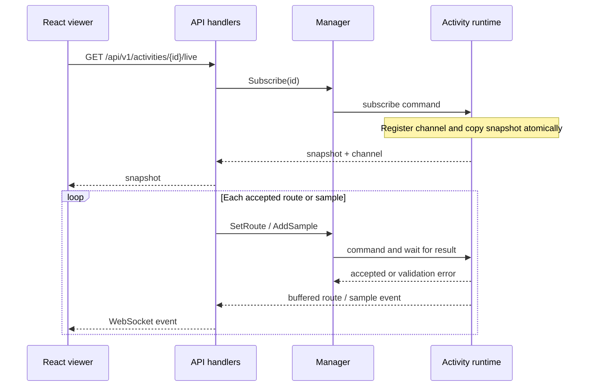

# Initial monorepo architecture

The structure follows the programs that run independently: `apps/api` for the Go server, `apps/simulator` for the Go replay client, and `apps/web` for React. Examples, contracts, and documents stay at the repository root. The API and simulator each have a Dockerfile but share the root Go module and private packages in `internal`. The web app maintains its own npm dependencies.

The web app calls the API through relative `/api/v1/...` paths and opens the WebSocket on the same host as the page. In development, Vite proxies these requests to `127.0.0.1:8081`. In Compose, Nginx proxies them to the `api:8081` service. This keeps browser URLs consistent in both environments.

The v1 network contract is documented in `contracts/http-ws-v1.md`. The corresponding Zod schemas live in `apps/web/src/shared/api/schemas.ts`, with inferred TypeScript types in `apps/web/src/shared/api/types.ts`; the Go types remain in `internal/tracking`. Ky handles the web app's HTTP requests. The contract document is the shared reference until schema generation becomes useful.

One JavaScript package does not warrant npm workspaces. One Go module does not warrant `go.work`. These tools can be added if more packages or modules appear.

## Live activity flow

The manager's lock protects only the activity registry and shutdown admission. Each activity runtime serializes its own commands and is the sole writer of its samples, route, and subscriber set. Commands for activity B can progress while activity A is busy. A bounded command queue applies backpressure to ingestion instead of dropping telemetry.

The subscription command registers a viewer and copies its snapshot inside the same runtime turn. Later `sample` and `route` events therefore follow that snapshot without a gap. Broadcast to each viewer's 64-message channel is non-blocking: a full channel disconnects that viewer, while ingestion and other viewers continue.

On shutdown, the manager rejects new operations, waits for already admitted commands, signals every runtime to stop, and waits for their goroutines to exit. Each runtime closes its subscriber channels exactly once. Unsubscribe remains safe even if a slow viewer was already disconnected or shutdown has started.
